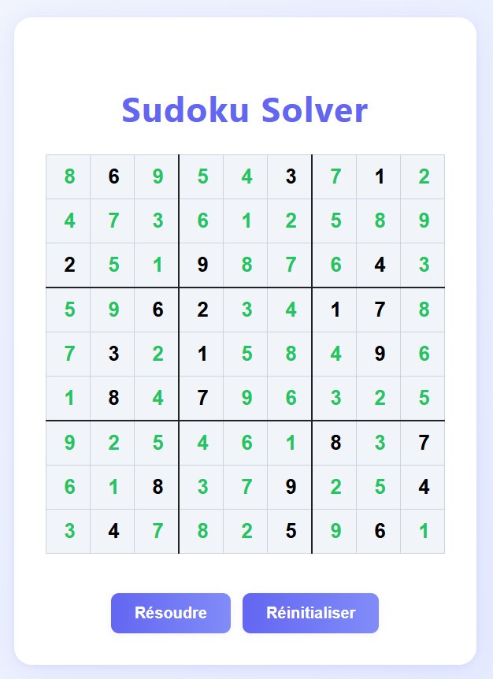

# SudokuVueJS

Une application Vue 3 (Vite) pour jouer et résoudre des grilles de Sudoku.

## Fonctionnalités

- Grille de Sudoku interactive à remplir
- Résolution automatique de la grille (bouton "Résoudre")
- Les chiffres saisis par l'utilisateur sont affichés en noir, ceux générés par le solveur en vert
- Réinitialisation rapide de la grille
- Design moderne et responsive

## Prise en main

### Installation

```sh
npm install
```

### Lancer le serveur de développement

```sh
npm run dev
```

### Générer la version production

```sh
npm run build
```

## Utilisation

1. Remplissez la grille avec les chiffres connus (de 1 à 9)
2. Cliquez sur "Résoudre" pour compléter automatiquement la grille
3. Les chiffres ajoutés par le solveur apparaîtront en bleu
4. Cliquez sur "Réinitialiser" pour recommencer

## Technologies

- Vue 3
- Vite
- CSS moderne

## Capture d'écran



## Licence

MIT
